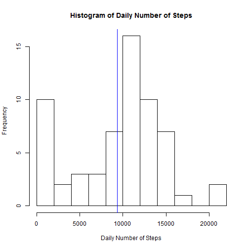
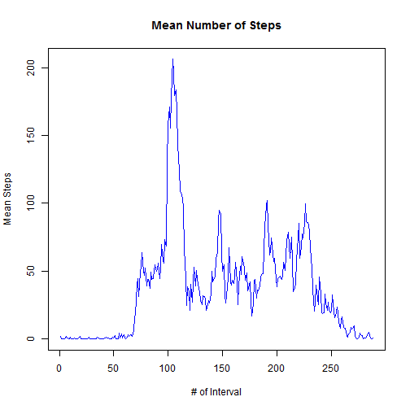
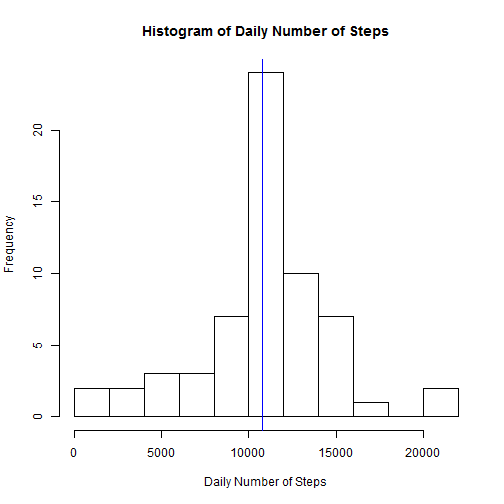
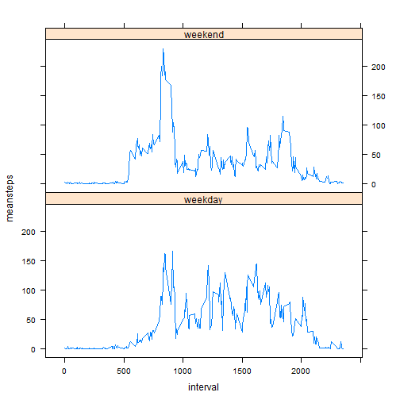

  
## Loading and preprocessing the data  
  
### 1. Load the data


```r
d <- read.csv("activity.csv")
```
  
### 2. Process/transform the data  
  
No preprocessing needed.  
  

## What is mean total number of steps taken per day?  
  
### 1. Calculate the total number of steps taken per day  


```r
library(data.table)
dd <- data.table(d)
dDaily <- dd[,sum(steps, na.rm=T), by=date]
setnames(dDaily, "V1", "sumsteps")
```
  
### 2. Histogram  
  

```r
hist(dDaily$sumsteps, breaks=10,
     main = "Histogram of Daily Number of Steps",
     xlab="Daily Number of Steps")
abline(v=mean(dDaily$sumsteps, na.rm=T), col="blue")
```

 
  
### 3. Mean and median  
  

```r
mean(dDaily$sumsteps, na.rm=T)
```

```
## [1] 9354.23
```

```r
median(dDaily$sumsteps, na.rm=T)
```

```
## [1] 10395
```
  
## What is the average daily activity pattern?  
  
### 1. Time series plot  
  

```r
dInterval <- dd[,mean(steps, na.rm=T), by=interval]
setnames(dInterval, "V1", "meansteps")
plot(dInterval$meansteps, 
     type="l", col="blue", 
     main="Mean Number of Steps", xlab = "# of Interval", ylab="Mean Steps", lwd=1)
```

 
  
### 2. Maximum number of steps  
  

```r
maxStepInt <- which.max(dInterval$meansteps)
maxStepInt
```

```
## [1] 104
```

```r
dInterval$interval[maxStepInt]
```

```
## [1] 835
```

The sequence number of the interval is 104; the value of this interval is 835. 
  
## Imputing missing values  
  
### 1. Total number of missing values  


```r
sum(is.na(d$steps))
```

```
## [1] 2304
```
  
### 2. Imputing strategy  
  
Mean of the interval will be fine.  
  
### 3. New dataset with missing values filled in  
  

```r
library(dplyr)
d2 <- left_join(d, dInterval, by="interval")
misrow <- is.na(d2$steps)
d2$steps[misrow] <- d2$meansteps[misrow]
d2$meansteps <- NULL
```
  
### 4. New histogram, mean and median total number  
  
**Histogram of the total number of steps** *on the imputed dataset*:


```r
dd2 <- data.table(d2)
dDaily2 <- dd2[,sum(steps, na.rm=T), by=date]
setnames(dDaily2, "V1", "sumsteps")
hist(dDaily2$sumsteps, breaks=10,
     main = "Histogram of Daily Number of Steps",
     xlab="Daily Number of Steps")
abline(v=mean(dDaily2$sumsteps, na.rm=T), col="blue")
```

 
  
**Mean and median total number of steps**  


```r
mean(dDaily2$sumsteps, na.rm=T)
```

```
## [1] 10766.19
```

```r
median(dDaily2$sumsteps, na.rm=T)
```

```
## [1] 10766.19
```

The estimates on the mean and median of the total number of steps based on the imputed dataset are higher than those based on the original dataset. The difference for the mean is 1412, and for the median it is 371.2.  
This is because we sum up the values of all intervals in a day (whereas in the original dataset, we sum up the values of the non-missing intervals only).
  
## Are there differences in activity patterns between weekdays and weekends?  
  
### 1. create new factor variable  
  

```r
library(lubridate)
dd2 <- mutate(dd2, wd=factor(wday(date) %in% 2:6, 
                             labels=c("weekday", "weekend")))
```
  
### 2. Panel plot time series  
  

```r
pd1 <- group_by(dd2, wd, interval, add=T)
plotData <- summarize(pd1, meansteps=mean(steps))

library(lattice)
xyplot(meansteps~interval|wd, data=plotData, 
       type = "l",
       layout=c(1,2))
```

 
